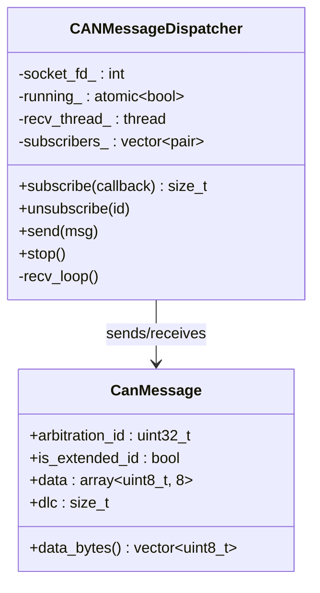
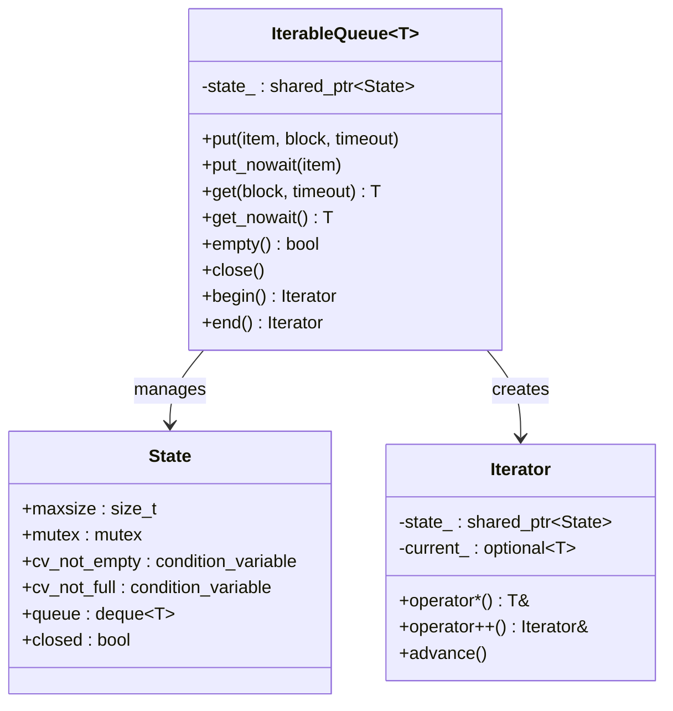
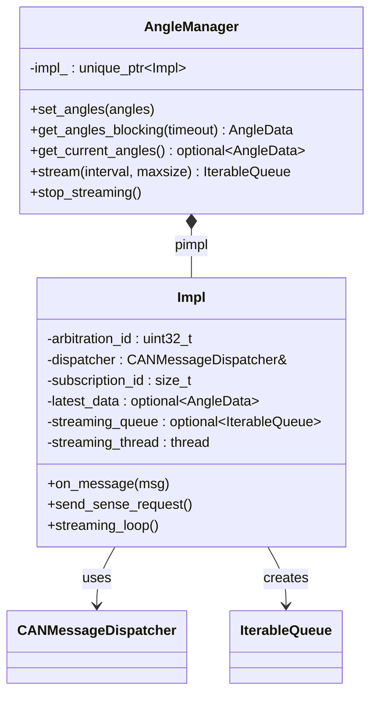
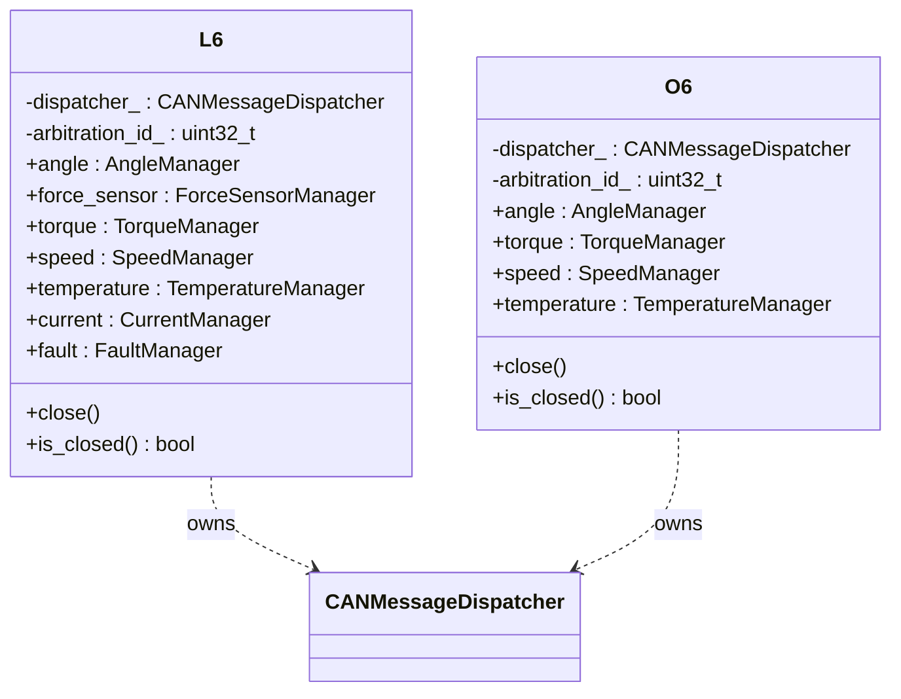
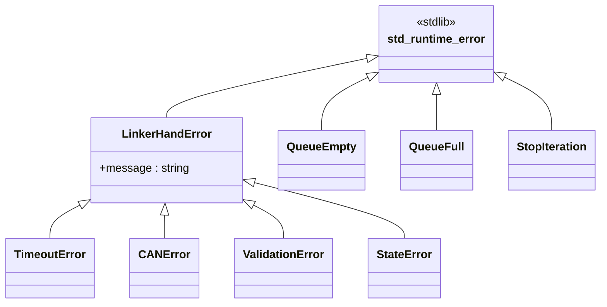
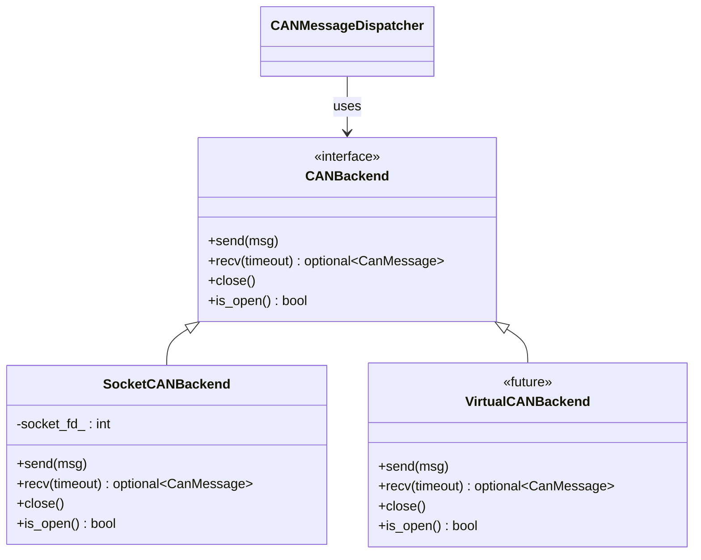
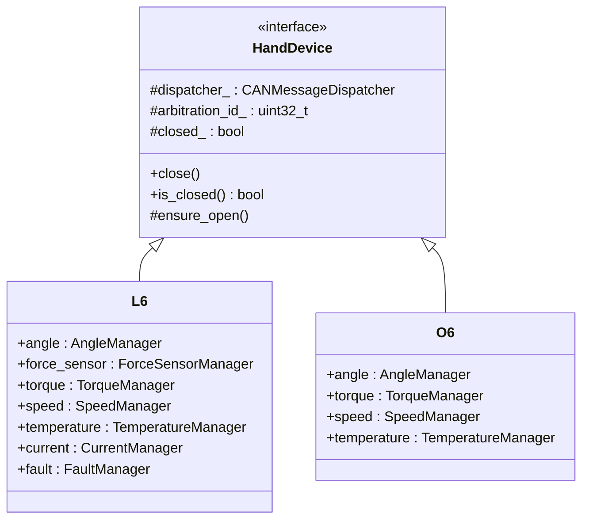
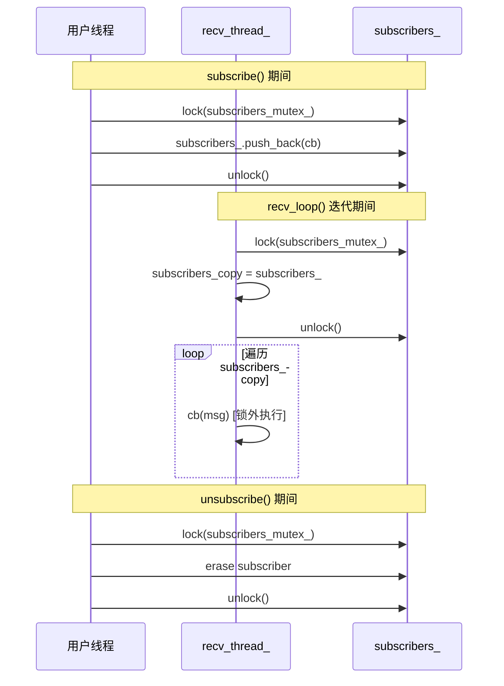
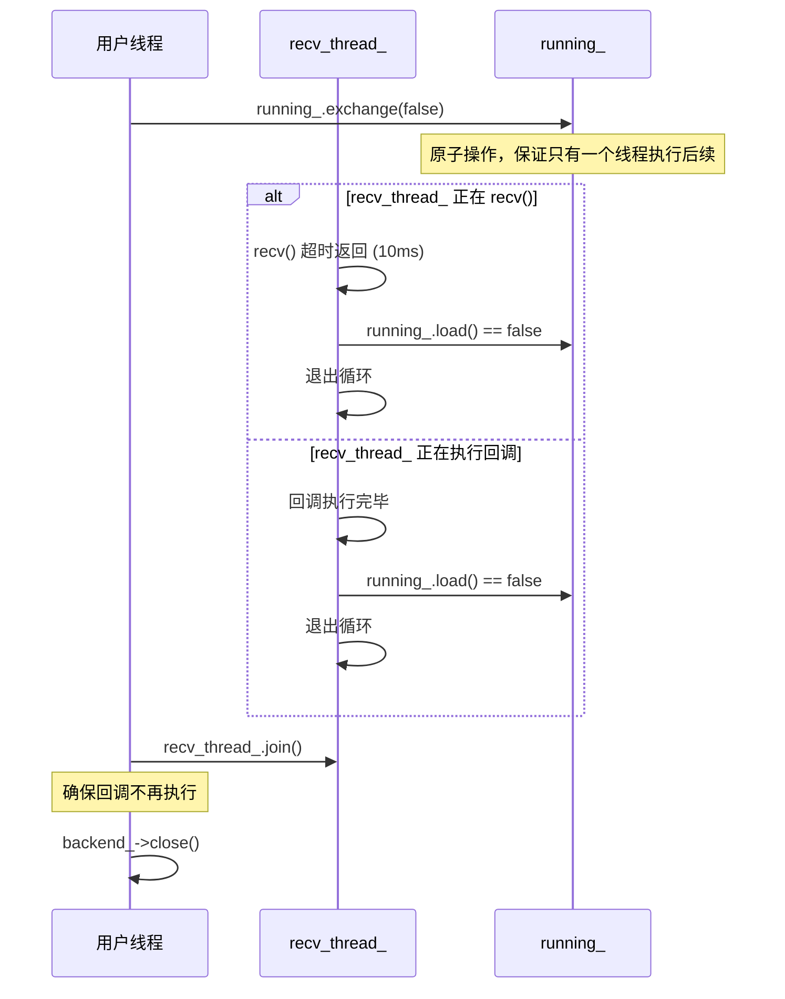

# LinkerHand C++ SDK 架构文档

## 1. 概述

LinkerHand C++ SDK 是 LinkerHand 系列机械手的硬件抽象层。它通过 CAN 总线（SocketCAN）为控制和监控机械手设备提供了一个简洁、类型安全的 C++17 接口。

### 关键特性

| 方面 | 描述 |
|--------|-------------|
| **语言标准** | C++17 |
| **构建系统** | CMake 3.16+ |
| **通信方式** | SocketCAN (Linux) |
| **线程模型** | 多线程，异步消息分发 |
| **架构风格** | 基于组件的组合模式 |

---

## 2. 系统架构

可以抽象出一个跨设备以及can设备的抽象类，便于扩展不同的设备以及can设备。

```
┌─────────────────────────────────────────────────────────────────┐
│                      用户应用程序                                │
├─────────────────────────────────────────────────────────────────┤
│                    linkerhand.hpp (入口点)                      │
│                          L6 等                                │
├──────────────────────────┬──────────────────────────────────────┤
│      管理器层            │        基础设施层                     │
│  ┌─────────────────────┐ │  ┌──────────────────────────────┐   │
│  │   AngleManager      │ │  │   CANMessageDispatcher       │   │
│  │   TorqueManager     │ │  │   - subscribe(callback)      │   │
│  │   SpeedManager      │◄├──│   - send(message)            │   │
│  │   TemperatureManager│ │  │   - recv_loop (background)   │   │
│  │   CurrentManager    │ │  └──────────────────────────────┘   │
│  │   FaultManager      │ │  ┌──────────────────────────────┐   │
│  │   ForceSensorManager│ │  │   IterableQueue<T>           │   │
│  └─────────────────────┘ │  │   - Thread-safe              │   │
│                          │  │   - Blocking/Non-blocking    │   │
│                          │  │   - Iterator support         │   │
│                          │  └──────────────────────────────┘   │
├──────────────────────────┴──────────────────────────────────────┤
│                        SocketCAN (Linux 内核)                   │
├─────────────────────────────────────────────────────────────────┤
│                    CAN 硬件接口                                 │
└─────────────────────────────────────────────────────────────────┘
```

---

## 3. 目录结构

```
linkerhand-cpp-sdk/
├── CMakeLists.txt                 # 构建配置
├── include/linkerhand/           # 公共 API 头文件
│   ├── linkerhand.hpp            # 顶层入口（导出 L6, O6）
│   ├── can_dispatcher.hpp        # CAN 通信核心
│   ├── exceptions.hpp            # 异常层次结构
│   ├── iterable_queue.hpp        # 线程安全队列模板
│   └── hand/
│       ├── l6/                   # L6 系列
│       │   ├── l6.hpp            # L6 外观类
│       │   ├── angle_manager.hpp
│       │   ├── torque_manager.hpp
│       │   ├── speed_manager.hpp
│       │   ├── temperature_manager.hpp
│       │   ├── current_manager.hpp
│       │   ├── fault_manager.hpp
│       │   └── force_sensor_manager.hpp
│       └── o6/                   # O6 系列
│           ├── o6.hpp
│           ├── angle_manager.hpp
│           ├── torque_manager.hpp
│           ├── speed_manager.hpp
│           └── temperature_manager.hpp
└── src/
    ├── can_dispatcher.cpp        # CAN 实现
    └── hand/
        ├── common.hpp            # 共享工具（内部）
        ├── l6/*.cpp              # L6 实现
        └── o6/*.cpp              # O6 实现
```

---

## 4. 核心组件

### 4.1 CANMessageDispatcher

使用**观察者模式**的通信骨干。



**关键特性：**
- 不可复制、不可移动（RAII 资源管理）
- 后台线程用于消息接收
- 线程安全的订阅者管理
- Linux SocketCAN 原生支持

### 4.2 IterableQueue\<T\>

支持**迭代器模式**的线程安全、有界队列，用于流式数据。



**关键特性：**
- 有界/无界模式
- 支持可选超时的阻塞操作
- 标准输入迭代器接口
- 通过 `close()` 优雅关闭

### 4.3 Manager 类（PImpl 模式）

所有 Manager 类都遵循 **PImpl（指向实现的指针）** 惯用法，以确保 ABI 稳定性。
只暴露可以调用的接口，具体实现在Impl中实现。



**通用 Manager 接口：**
```cpp
// 同步（阻塞）读取
DataType get_XXX_blocking(double timeout_ms);

// 异步（缓存）读取
std::optional<DataType> get_current_XXX() const;

// 支持迭代器的流式读取
IterableQueue<DataType> stream(double interval_ms, std::size_t maxsize);
void stop_streaming();
```

---

## 5. 设备模型层次结构




---

## 6. 应用的设计模式

| 模式 | 应用 | 优势 |
|---------|-------------|---------|
| **PImpl** | 所有 Manager 类 | ABI 稳定性，编译防火墙 |
| **Observer** | CANMessageDispatcher 回调 | 解耦的消息处理 |
| **Composition** | L6/O6 拥有 Managers | 灵活的功能组装 |
| **RAII** | 所有资源拥有类 | 自动清理 |
| **Iterator** | IterableQueue | STL 兼容的流式处理 |
| **Template** | IterableQueue\<T\> | 类型安全的泛型容器 |

---

## 7. 异常层次结构



---

## 8. 数据流

### 8.1 命令流（写入）

```
用户代码                                    硬件
    │                                           │
    │  set_angles({0,45,90,...})               │
    ▼                                           │
┌─────────────┐     CanMessage      ┌──────────┴────────┐
│AngleManager │ ───────────────────►│CANMessageDispatcher│
│   Impl      │                     │      send()       │
└─────────────┘                     └──────────┬────────┘
                                               │
                                    ┌──────────▼────────┐
                                    │   SocketCAN       │
                                    │   (Linux 内核)     │
                                    └──────────┬────────┘
                                               │
                                               ▼
                                         CAN 总线帧
```

### 8.2 传感器流（读取/流式）

```
硬件                                        用户代码
    │                                           │
    │  CAN 响应帧                                │
    ▼                                           │
┌──────────────────┐                            │
│   SocketCAN      │                            │
└────────┬─────────┘                            │
         │  recv_loop()                         │
         ▼                                      │
┌──────────────────┐    callback    ┌──────────┴────────┐
│CANMessageDispatcher├─────────────►│  Manager::Impl    │
│   (后台线程)      │               │  on_message()     │
└──────────────────┘                └──────────┬────────┘
                                               │
                        ┌──────────────────────┼──────────────────────┐
                        │                      │                      │
                        ▼                      ▼                      ▼
                ┌───────────────┐   ┌───────────────────┐   ┌─────────────────┐
                │ latest_data_  │   │ waiters_ (通知)    │   │ streaming_queue │
                │ (缓存)        │   │ (阻塞读取)        │   │ (put_nowait)    │
                └───────────────┘   └───────────────────┘   └────────┬────────┘
                        │                      │                      │
                        ▼                      ▼                      ▼
              get_current_angles()   get_angles_blocking()    for(auto& d : stream())
```

---

## 9. 抽象层设计

### 9.1 现有抽象：CANBackend

项目已实现 CAN 通信层的抽象，支持不同的 CAN 后端实现：



```cpp
// include/linkerhand/can_backend.hpp
class CANBackend {
 public:
  virtual ~CANBackend() = default;

  virtual void send(const CanMessage& msg) = 0;
  virtual std::optional<CanMessage> recv(std::chrono::milliseconds timeout) = 0;

  virtual void close() = 0;
  virtual bool is_open() const = 0;
};

// 工厂函数：根据 interface_type 创建对应后端
std::unique_ptr<CANBackend> create_backend(
    const std::string& interface_name,
    const std::string& interface_type);
```

### 9.2 建议抽象：HandDevice 基类

当前 L6/O6 类有重复的生命周期管理代码，建议引入设备抽象基类：



**建议实现**：

```cpp
// include/linkerhand/hand/hand_device.hpp
namespace linkerhand::hand {

class HandDevice {
 protected:
  CANMessageDispatcher dispatcher_;
  std::uint32_t arbitration_id_;
  bool closed_ = false;

  void ensure_open() const {
    if (closed_) {
      throw StateError("Device is closed. Create a new instance.");
    }
  }

  // 子类实现：停止所有流式传输
  virtual void stop_all_streaming() = 0;

 public:
  HandDevice(const std::string& side,
             const std::string& interface_name,
             const std::string& interface_type = "socketcan")
      : dispatcher_(interface_name, interface_type),
        arbitration_id_(side == "right" ? 0x27 : 0x28) {}

  virtual ~HandDevice() {
    try { close(); } catch (...) {}
  }

  HandDevice(const HandDevice&) = delete;
  HandDevice& operator=(const HandDevice&) = delete;

  void close() {
    if (closed_) return;  // 幂等
    try { stop_all_streaming(); } catch (...) {}
    try { dispatcher_.stop(); } catch (...) {}
    closed_ = true;
  }

  bool is_closed() const { return closed_; }
};

}  // namespace linkerhand::hand
```

---

## 10. 生命周期契约

### 10.1 契约总览

| 组件 | 方法 | 幂等性 | 异常行为 | 关闭后调用 |
|------|------|--------|----------|------------|
| `L6/O6` | `close()` | ✓ 幂等 | 吞掉所有异常 | 无操作 |
| `L6/O6` | 析构函数 | ✓ 幂等 | 调用 `close()`，吞异常 | N/A |
| `L6/O6` | 其他方法 | - | 正常抛出 | 抛 `StateError` |
| `CANMessageDispatcher` | `stop()` | ✓ 幂等 | 吞掉后端异常 | 无操作 |
| `CANMessageDispatcher` | `send()` | - | 抛 `CANError` | 抛 `CANError` |
| `Manager::Impl` | `stop_streaming()` | ✓ 幂等 | 不抛异常 | 无操作 |
| `IterableQueue` | `close()` | ✓ 幂等 | 不抛异常 | 无操作 |
| `IterableQueue` | `put()` | - | 可能阻塞/超时 | 抛 `StateError` |
| `IterableQueue` | `get()` | - | 可能阻塞/超时 | 抛 `StopIteration` |

### 10.2 析构顺序

```
L6/O6 析构
    │
    ├─► close() [幂等，吞异常]
    │       │
    │       ├─► 各 Manager.stop_streaming() [幂等]
    │       │       │
    │       │       └─► streaming_queue.close()
    │       │           streaming_thread.join()
    │       │
    │       └─► dispatcher_.stop() [幂等]
    │               │
    │               ├─► running_.exchange(false)
    │               ├─► recv_thread_.join()
    │               └─► backend_->close()
    │
    └─► 各 Manager 析构 (成员逆序)
            │
            └─► Impl 析构
                    │
                    ├─► stop_streaming() [已在 close() 中调用]
                    └─► dispatcher.unsubscribe(subscription_id)
```

### 10.3 关键实现细节

**CANMessageDispatcher::stop() 幂等实现**：

```cpp
void CANMessageDispatcher::stop() {
  // 原子交换保证只执行一次
  const bool was_running = running_.exchange(false);
  if (was_running && recv_thread_.joinable()) {
    recv_thread_.join();  // 等待接收线程退出
  }
  if (backend_) {
    try {
      backend_->close();  // 关闭底层连接
    } catch (...) {
      // 吞掉异常，避免析构时抛出
    }
  }
}
```

**Manager::stop_streaming() 幂等实现**：

```cpp
void stop_streaming() {
  std::optional<IterableQueue<AngleData>> queue_to_close;
  {
    std::lock_guard<std::mutex> lock(streaming_mutex);
    if (!streaming_queue.has_value()) {
      return;  // 幂等：未启动流或已停止
    }
    streaming_running.store(false);
    queue_to_close = streaming_queue;
    streaming_queue.reset();
  }
  // 锁外操作，避免死锁
  queue_to_close->close();  // 唤醒阻塞的迭代器
  if (streaming_thread.joinable()) {
    streaming_thread.join();
  }
}
```

**L6::close() 幂等实现**：

```cpp
void L6::close() {
  if (closed_) return;  // 幂等检查

  // 先停止所有流式传输
  try {
    force_sensor.stop_streaming();
    angle.stop_streaming();
    torque.stop_streaming();
    temperature.stop_streaming();
    current.stop_streaming();
  } catch (...) {}

  // 再停止调度器
  try {
    dispatcher_.stop();
  } catch (...) {}

  closed_ = true;
}
```

### 10.4 Close 后行为一致性

| 操作类型 | Close 后行为 | 异常类型 |
|----------|--------------|----------|
| `hand.angle.set_angles()` | 抛异常 | `CANError` (dispatcher stopped) |
| `hand.angle.get_angles_blocking()` | 抛异常 | `CANError` |
| `hand.angle.stream()` | 抛异常 | `CANError` |
| `hand.close()` | 无操作（幂等） | 无 |
| `hand.is_closed()` | 返回 `true` | 无 |
| 已存在的 `stream` 迭代器 | 抛异常 | `StopIteration` |

---

## 11. 并发与回调语义

### 11.1 线程模型

```
┌─────────────────────────────────────────────────────────────────┐
│                         用户线程                                 │
│  ┌─────────────┐  ┌─────────────┐  ┌─────────────┐              │
│  │ main()      │  │ worker1()   │  │ worker2()   │              │
│  │ set_angles()│  │ stream()    │  │ get_blocking│              │
│  └──────┬──────┘  └──────┬──────┘  └──────┬──────┘              │
│         │                │                │                      │
└─────────┼────────────────┼────────────────┼──────────────────────┘
          │                │                │
          ▼                ▼                ▼
┌─────────────────────────────────────────────────────────────────┐
│                    CANMessageDispatcher                         │
│  ┌─────────────────────────────────────────────────────────┐   │
│  │                    recv_thread_ (后台)                   │   │
│  │                                                          │   │
│  │  while (running_) {                                      │   │
│  │    msg = backend_->recv(10ms);                          │   │
│  │    // 复制订阅者列表（锁内）                              │   │
│  │    for (callback : subscribers_copy) {                   │   │
│  │      callback(msg);  // ← 回调在此线程执行               │   │
│  │    }                                                     │   │
│  │  }                                                       │   │
│  └─────────────────────────────────────────────────────────┘   │
└─────────────────────────────────────────────────────────────────┘
```

### 11.2 回调执行规则

**回调在 `recv_thread_` 中执行**，需遵守以下规则：

| 规则 | 说明 | 违反后果 |
|------|------|----------|
| **禁止长时间阻塞** | 回调应快速返回（< 1ms） | 阻塞所有订阅者和消息接收 |
| **禁止调用 `stop()`** | 会导致死锁（等待自身线程） | 程序挂起 |
| **异常会被捕获** | 回调抛出的异常被吞掉并打印到 stderr | 其他订阅者继续执行 |
| **线程安全访问共享数据** | 回调内访问共享数据需加锁 | 数据竞争 |

**回调异常处理**：

```cpp
void CANMessageDispatcher::recv_loop() {
  while (running_.load()) {
    auto maybe_msg = backend_->recv(std::chrono::milliseconds{10});
    if (!maybe_msg) continue;

    // 复制订阅者列表，避免回调中修改列表导致迭代器失效
    std::vector<std::pair<std::size_t, Callback>> subscribers_copy;
    {
      std::lock_guard<std::mutex> lock(subscribers_mutex_);
      subscribers_copy = subscribers_;
    }

    for (const auto& [id, cb] : subscribers_copy) {
      try {
        cb(*maybe_msg);  // 单个回调异常不影响其他订阅者
      } catch (const std::exception& e) {
        std::cerr << "CANMessageDispatcher callback error: " << e.what() << "\n";
      } catch (...) {
        std::cerr << "CANMessageDispatcher callback error: unknown\n";
      }
    }
  }
}
```

### 11.3 subscribe/unsubscribe 并发策略



**关键设计**：
- **复制后迭代**：`recv_loop` 在锁内复制订阅者列表，锁外迭代调用回调
- **避免死锁**：回调执行时不持有锁，允许回调内调用 `subscribe`/`unsubscribe`
- **延迟生效**：`unsubscribe` 后，如果 `recv_loop` 已复制列表，该回调仍可能被调用一次

### 11.4 stop() 时的竞态处理



**保证**：
1. `stop()` 返回后，**不会再有新的回调被调用**
2. Manager 析构时先 `stop()` 再 `unsubscribe()`，避免回调访问已析构对象
3. 原子变量 `running_` 保证 `stop()` 幂等

### 11.5 Manager 内部并发保护

每个 Manager::Impl 维护多个互斥锁，保护不同的数据：

```cpp
struct AngleManager::Impl {
  // 保护最新数据缓存
  mutable std::mutex latest_mutex;
  std::optional<AngleData> latest_data;

  // 保护阻塞等待者列表
  mutable std::mutex waiters_mutex;
  std::vector<std::shared_ptr<AngleWaiter>> waiters;

  // 保护流式传输状态
  mutable std::mutex streaming_mutex;
  std::optional<IterableQueue<AngleData>> streaming_queue;
  std::optional<double> streaming_interval_ms;
  std::atomic<bool> streaming_running{false};
  std::thread streaming_thread;

  void on_message(const CanMessage& msg) {
    // 此方法在 recv_thread_ 中调用
    // 需要按正确顺序获取锁，避免死锁

    // 1. 更新缓存（短临界区）
    {
      std::lock_guard<std::mutex> lock(latest_mutex);
      latest_data = data;
    }

    // 2. 通知等待者（复制后锁外通知）
    std::vector<std::shared_ptr<AngleWaiter>> waiters_copy;
    {
      std::lock_guard<std::mutex> lock(waiters_mutex);
      waiters_copy = std::move(waiters);
    }
    for (const auto& waiter : waiters_copy) {
      // ... notify
    }

    // 3. 推送到流队列（锁外操作队列）
    std::optional<IterableQueue<AngleData>> q;
    {
      std::lock_guard<std::mutex> lock(streaming_mutex);
      q = streaming_queue;
    }
    if (q) q->put_nowait(data);
  }
};
```

---

## 12. 可扩展性分析

### 12.1 扩展点

| 扩展类型 | 机制 | 工作量 |
|---------------|-----------|--------|
| **新设备系列** | 添加 `hand/xxx/` 命名空间 | 中等 |
| **新传感器类型** | 添加新的 Manager 类 | 低 |
| **新 CAN 协议** | 扩展 `interface_type` | 中等 |

### 12.2 添加新设备系列（例如 L10）

```cpp
// 1. 创建命名空间: linkerhand::hand::l10

// 2. 创建设备外观类（继承建议的 HandDevice 基类）
namespace linkerhand::hand::l10 {

class L10 : public HandDevice {
 protected:
  void stop_all_streaming() override {
    angle.stop_streaming();
    custom.stop_streaming();
  }

 public:
  L10(const std::string& side, const std::string& interface_name,
      const std::string& interface_type = "socketcan")
      : HandDevice(side, interface_name, interface_type),
        angle(arbitration_id_, dispatcher_),
        custom(arbitration_id_, dispatcher_) {}

  AngleManager angle;          // 复用现有
  CustomSensorManager custom;  // 添加新的
};

}  // namespace linkerhand::hand::l10

// 3. 在 linkerhand.hpp 中导出
namespace linkerhand {
using hand::l10::L10;
}
```

### 12.3 添加新的 Manager 类型

```cpp
// 1. 定义数据结构
struct CustomData {
  std::array<int, N> values{};
  double timestamp = 0.0;
};

// 2. 定义公共接口（头文件）
class CustomManager {
public:
  CustomManager(std::uint32_t arbitration_id, CANMessageDispatcher& dispatcher);
  ~CustomManager();

  CustomData get_data_blocking(double timeout_ms = 100);
  std::optional<CustomData> get_current_data() const;
  IterableQueue<CustomData> stream(double interval_ms, std::size_t maxsize);
  void stop_streaming();

private:
  struct Impl;
  std::unique_ptr<Impl> impl_;
};

// 3. 使用现有模式实现（复制 angle_manager.cpp 作为模板）
```

### 12.4 架构约束

| 约束 | 原因 | 缓解措施 |
|------------|--------|------------|
| 仅限 Linux | SocketCAN 依赖 | 抽象到接口层 |
| 单一 CAN 接口 | 调度器设计 | 支持多调度器 |
| 8 字节 CAN 帧 | 标准 CAN 限制 | CAN FD 支持（未来） |

---

## 13. 构建与集成

### 13.1 CMake 用法

```cmake
# 在您的项目 CMakeLists.txt 中
add_subdirectory(linkerhand-cpp-sdk)
target_link_libraries(your_app PRIVATE linkerhand_cpp_sdk)
```

### 13.2 最小示例

```cpp
#include <linkerhand/linkerhand.hpp>

int main() {
    // 创建左手实例
    linkerhand::L6 hand("left", "can0");

    // 设置关节角度
    hand.angle.set_angles({128, 128, 128, 128, 128, 128});

    // 读取当前角度（阻塞）
    auto data = hand.angle.get_angles_blocking(100);

    // 流式读取温度数据
    auto stream = hand.temperature.stream(100, 50);
    for (const auto& temp : stream) {
        // 处理温度数据
    }

    hand.close();
    return 0;
}
```

---


## 14. 总结

LinkerHand C++ SDK 展示了一个适用于硬件抽象的简洁、模块化架构：

- **关注点分离**：通信、数据管理和设备逻辑相互隔离
- **类型安全**：使用 C++17 特性（optional，variant-ready）的强类型
- **线程安全**：在调度器和队列中正确同步
- **可扩展性**：添加设备和传感器的清晰模式
- **资源安全**：全程使用 RAII，无需手动内存管理

该架构支持增量扩展，同时通过 PImpl 惯用法和命名空间隔离保持向后兼容性。
